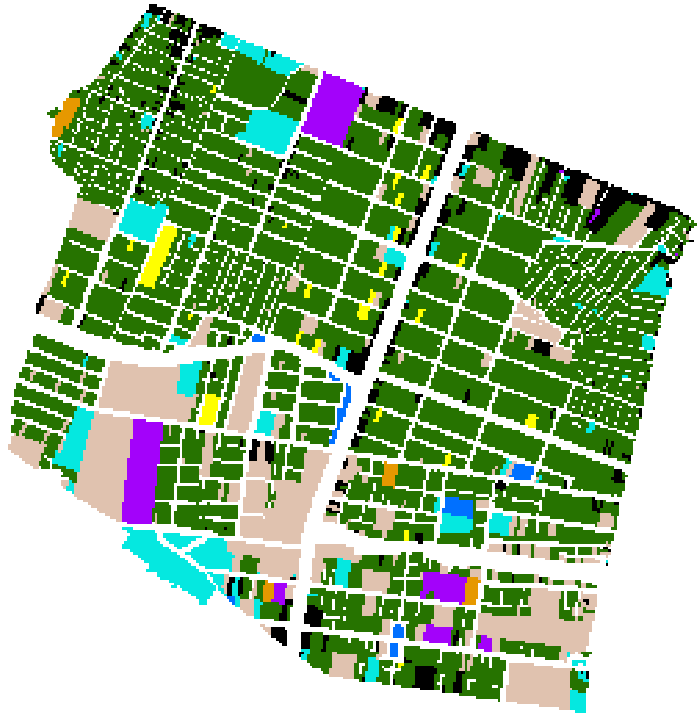

# 🗺 **python code for calculating neighborhood maps from a landuse map** 🗺

This is a piece of code written to calculate the transition functions of different landuses and using them, a neighborhood map for each desired landuse. The objective is to calculate and use the neighborhood maps as one of the parameters in _RIKS_ Cellular Automata Land use Model and determine the most fitting landuse for a parcel/pixel with no current landuse or changeable landuses.

## Methodology 👨‍🔬

To determine the transition functions, we are using a statistical approach and will calculate the _Enrichment Factor (EF)_ between every pair of landuses. By calculating the logarithm of these values, we can calculate the enrichment factor (**Verburg et al., 2004**).
Afterwards we will use these functions to calculate the neighborhood maps using a formula (**Van Vliet, et al, 2009**) to calculate the neighborhood maps with these functions.
These maps will also be Normalized to values between 0.1 and 0.9 so that the importance of this factor in future landuse planning project will be neither very low nor very high.

## All you need to know/do 🤔

Besides the notes and comments in the code, here is some info about the code and its functionality:

- You need the following libraries in your environment to run the script:
  - numpy - basic calculations
  - matplotlib - plotting
  - tqdm - progress bar
  - os - basic terminal and directory operations
  - Pillow - image import
  - csv - landuse code and color import
- The input data should be placed in a folder in the same directory as the code (in this code, a folder named `data` has been used). the files needed are:
  - A landuse map (imported as `img` in the code)
  
  - A txt or csv file containing the codes and RGB colors of different landuses in the map (imported as `csvfile` in the code)
- The neighborhood size of the transition functions (distance) will be between 1 and 8 pixels, creating masks between 3x3 and 17x17 pixels. The mask will be cropped if any part of it falls out of the boundaries of the base landuse image and the values will be calculated with the cropped mask.
- Since we will be calculating logarithm of the enrichment factors to create the transition functions, we will skip calculating logarithm of possible 0 values to prevent infinite values in our transition function.
- The output (which consists of multiple transition function figures and Neighborhood maps of landuses with codes 1-6) will be placed in a folder named `outputs` in the `data` folder.
  - Transition function figures will be named `fig#XY` where:
    - **X** will be the landuse being affected (L in plot)
    - **Y** will be the landuse effecting landuse X (K in plot)
  
  - Neighborhood maps will be named `N-map#X` where:
    - **X** is the code of the landuse of the map (L in plot)
  

## future plans ⏳

- [x] Speed optimization 🏃‍♂️
- [X] Memory optimization 💾
- [ ] Automatic landuse code and color dictionary creation option 📝
- [ ] Possible code optimization 👨‍💻
